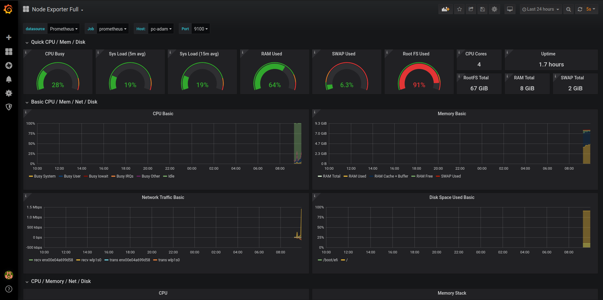

# Monitor machine metrics on a Raspberry Pi 

### Description:
In this tutorial we will exposte most of the linux system metrics to a prometheus server running on a Raspberry Pi. The visualization of the collected data will be done with Grafana, also running on the raspberry pi. 

Tested on: ubuntu 19.10 and raspian buster (v. 10)

### Tools and technologies: Linux, Bash, Prometheus, Grafana


## Install node exporter on your main machine
On a linux machine install the prometheus node exporter

```sh
wget https://github.com/prometheus/node_exporter/releases/download/v1.0.0-rc.0/node_exporter-1.0.0-rc.0.linux-amd64.tar.gz
tar xvfz node_exporter*
cd node_exporter-*
./node_exporter
```
## Check the node exporter
By default it will export metreics to localhost:9100.
You can check the metrics by issuing the following command:
```sh 
curl http://localhost:9100/metrics
```


#### Useful tools to check the status of the node exporter
```sh
lsof -i -n -P | grep LISTEN
/etc/init.d/node_exporter [start|stop|status]
```


### Installation on RP (or any ARM based system)

## Prometheus

```sh
wget https://github.com/prometheus/prometheus/releases/download/v2.6.0/prometheus-2.6.0.linux-armv7.tar.gz
tar xfz prometheus-2.6.0.linux-armv7.tar.tar.gz   
cd prometheus-2.6.6.0.linux-armv7/
```
## Configure prometheus

Modify the yaml file

```
global:# Default is every 1 minute.   
   scrape_configs:  
  # server prometheus listens on TCP/9090  
  - job_name:'prometheus'.  
         #metrics_path defaults to "/metrics  
         #scheme defaults to "http".  
      static_configs:  
        - targets: ['localhost:9090']
 
  # Exporters: client servers  
  - job_name:'nodes'.  
     scrape_interval: 1m # Override the default global interval for this job  
     scrape_timeout: 10s # Override the default global timeout for this job  
     static_configs:  
     - targets: [' 172.28.0.0.4:9100']

```


# Start the prometheus server
```sh
nohup ./prometheus & 
```

## Grafana
```sh
sudo apt-get install -y adduser libfontconfig1
wget https://dl.grafana.com/oss/release/grafana_6.7.3_armhf.deb
sudo dpkg -i grafana_6.7.3_armhf.deb
sudo /bin/systemctl daemon-reload
sudo /bin/systemctl enable grafana-server
```
## Check that grafana is working
```sh
sudo /bin/systemctl status grafana-server
sudo /bin/systemctl start grafana-server
sudo /bin/systemctl status grafana-server
```
By default grafana will start on port 3000. Using a browser, connect to the Grafana server: http://[RP IP address]:3000

To change the default port number, modify the following configuration: /etc/grafana/grafana.ini


Connect to grafana; choose "prometheus" as a "data source".

Load the provided json file (node-exporter-full_rev18) for the default node exporter dashboard.

The final dashboard should look like the following:




License
----

**Free Software!**
For the benefit of everyone.


